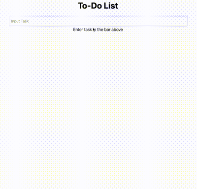

<h1 align="center">React Todo App</h1>

This is a quick and simple implementation of a Todo app created with React and Tailwind CSS. The app implements local storage, thus saving the tasks even when user refreshes the page.

## Deployed App

[Redirect to Netlify Deployment](https://dancing-nougat-b2c19a.netlify.app/)

## How to Run App Locally

### Pre-Requisites:

- Must have npm installed on local device

### Steps:

1. Clone this repository
2. Use npm to install all the dependencies
3. Run the project using `npm run start`
4. Go to http://localhost:3000 with the browser of your choice

## Showcase

#### This project was bootstrapped with create-react-app
